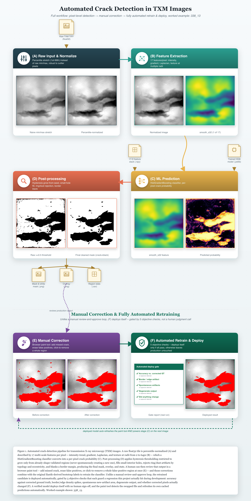

# TXM Crack Detection Pipeline

Automated crack detection for transmission X-ray microscopy (TXM) images:
a per-pixel machine learning classifier, a browser-based correction tool,
and a fully automated retrain-verify-deploy loop, plus a benchmark suite
comparing every model tried along the way.

**Current production model: MLP (neural network).** See
[Model history](#model-history--why-mlp) for why, and
[final_figures/](final_figures/) for the full comparison.



---

## Quick start

### 1. Run the model on a new image

```bash
python3 code/apply_pixel_model.py path/to/raw_image.tif \
    --model models/pixel_hgb_final.joblib \
    --out-dir results/my_output
```

Produces `<name>_crack_mask.png` (crack = black, background = white),
`<name>_overlay.png` (grayscale + red crack overlay), and
`<name>_stats.csv` (one row per detected crack region: area, solidity,
eccentricity, centroid).

> Note: `models/pixel_hgb_final.joblib` is the production model *path* —
> the filename says "hgb" for historical reasons (that's what it was when
> the path was first set up), but it currently contains an MLP pipeline.
> Everything in this repo references this path, not a hardcoded
> architecture, so the filename staying stable matters more than it being
> literally accurate. See [Model history](#model-history--why-mlp).

### 2. Review / correct predictions in the browser

```bash
python3 code/paint_server.py
```

Then open **http://127.0.0.1:8766**. Pick an image from the dropdown,
review the red overlay, and:

- **Add crack** brush — mark pixels the model missed
- **Eraser** brush — mark false positives as background
- **Click-to-remove** — click once inside a whole false-positive region to
  clear it in one action (fastest way to clean up scattered speckle)
- **Save corrections** — persists to `paint/corrections/`, regenerates
  `results/corrected/<name>_{crack_mask,overlay,stats}.*` immediately

Corrections accumulate across sessions and combine with the original
Ilastik-derived bootstrap labels the next time you retrain.

### 3. Retrain

```bash
# Automated: trains, runs 5 regression checks against current
# production, and deploys itself only if every check passes.
python3 code/retrain_and_deploy.py

# Manual: trains a candidate, does NOT touch production.
python3 code/retrain_with_corrections.py --out models/my_candidate.joblib
```

**The paint tool picks up a newly deployed model automatically** — it
checks the production model file's mtime on every request and
invalidates its cache the moment it changes. No restart, no manual
cache-clear. This was tested live twice: once mid-session by swapping
models while the server ran, and once for real during the HGB→MLP
deployment described below.

---

## How the pipeline works

1. **Raw input & normalize** — percentile-stretch (1st–99th) instead of
   raw min/max, robust to outlier pixels.
2. **Feature extraction** — 17 features per pixel: raw intensity,
   Gaussian-smoothed intensity at 6 scales (σ = 2–64px, the single most
   important feature group), gradient magnitude at 4 scales, Laplacian at
   4 scales, local-std texture at 2 scales. See `code/txm_features.py`.
3. **ML prediction** — the classifier outputs a per-pixel crack
   probability.
4. **Post-processing** — hysteresis thresholding restricted to grow only
   from already shape-validated regions (never spontaneously inventing a
   new one — this was a real bug caught and fixed, see
   `code/apply_pixel_model.py`), small-hole filling, ring/dust rejection
   by topology and eccentricity, and a border margin blank (large-σ
   filtering creates edge artifacts).
5. **Manual correction** — the browser paint tool above.
6. **Automated retrain & deploy** — 5 objective checks, each one encoding
   a real regression this project actually hit during development:
   accuracy vs. corrected ground truth, border/edge density spikes,
   spontaneous new-artifact area, degenerate output, and whether
   corrected pixels actually changed. See `code/retrain_and_deploy.py`'s
   module docstring for the full incident history behind each check.

Full diagram with real thumbnails at every stage:
[pipeline_diagram/full_workflow_338_13.png](pipeline_diagram/full_workflow_338_13.png)
(regenerate with `python3 code/generate_pipeline_diagram.py <image_key>`).

---

## Model history & why MLP

Every model here was compared under the same leave-one-image-out (LOIO)
protocol — train on 3 of the 4 ground-truth images, test on the 4th,
rotate, average — specifically **not** random pixel-level k-fold, because
neighboring pixels are highly correlated and a random split leaks
information between train and test (measured directly: standard k-fold
inflates IoU by ~0.14–0.18 over LOIO for the same models — see
`final_figures/run_log.txt` and the conversation this was verified in).

| Model | Mean IoU (LOIO) | Notes |
|---|---|---|
| RandomForest | 0.684 | |
| ExtraTrees | 0.679 | |
| HistGradientBoosting | 0.692 | production until Aug 2026 |
| **MLP (neural network)** | **0.734** | **current production** |

MLP was adopted after clearing the *actual* production deploy gate (not a
lighter substitute) on the real training recipe (bootstrap=100k/class +
corrections=30k/class across all 12 images): mean IoU vs. corrected
ground truth **0.778** (was 0.742), zero border/artifact/degenerate-output
flags. It also cuts false positives by roughly 3× (2.0–2.2M pixels
misclassified as crack for the tree ensembles vs. 0.77M for MLP, on the
same held-out pixels) at a small recall cost — the right trade for a tool
whose main recurring problem has been spurious artifacts.

Full evidence, one figure per question:

| Figure | Question it answers |
|---|---|
| [fig1_model_comparison.png](final_figures/fig1_model_comparison.png) | Which architecture is most accurate? |
| [fig2_area_fraction_parity.png](final_figures/fig2_area_fraction_parity.png) | Does any model grossly over/under-predict crack area? |
| [fig3_roc_curves.png](final_figures/fig3_roc_curves.png) | How well does each model rank crack vs. background, independent of threshold? |
| [fig4_confusion_matrices.png](final_figures/fig4_confusion_matrices.png) | Exactly what kind of errors does each model make? |
| [fig5_feature_importance.png](final_figures/fig5_feature_importance.png) | Which of the 17 features actually matter? |
| [fig6_learning_curve.png](final_figures/fig6_learning_curve.png) | Does more training data keep helping? |
| [fig7_interpretability_tiers.png](final_figures/fig7_interpretability_tiers.png) | Is the black-box complexity actually earning its accuracy, vs. a simple threshold or a fitted equation? |
| [fig8_decision_boundary_comparison.png](final_figures/fig8_decision_boundary_comparison.png) | *Why* does MLP generalize better — what does its decision surface look like vs. a tree ensemble's? |

`final_figures/final_summary.json` has every number behind every figure.
`benchmark_figures/` holds the earlier, incremental versions of this
analysis (kept as an honest record of the development process — several
of those figures reused the same color for different things across
different charts, which `final_figures/` fixes with one global color
assignment: the 4 real models always get the 4 vivid colors, the 3
interpretability baselines always get a gray ramp).

If you retrain again, `retrain_and_deploy.py` will keep building MLP
candidates by default — the architecture choice lives in
`retrain_with_corrections.build_classifier()`, the single place both
scripts read it from, specifically so a future retrain can't silently
drift back to a superseded architecture.

---

## Known limitations

- **LARGE_343_75** (the one ~24-megapixel image, much larger than the
  others) has a residual border/vignetting artifact that was never fully
  resolved despite multiple fix attempts. It's also the image every
  model performs worst on. The MLP swap improved it somewhat but didn't
  eliminate it. If you see this, the paint tool's click-to-remove is the
  fastest cleanup, and it'll feed back into the next retrain.
- **Small, single-session ground truth.** All 4 ground-truth images (and
  most of the 12 corrected images) come from one imaging session on one
  specimen. LOIO here means "held out a different field of view of the
  same sample," not "held out a different sample or instrument." Accuracy
  numbers describe generalization within one visual distribution, not
  across distributions — validate on a few examples before trusting this
  on meaningfully different data (different alloy, scanner, or contrast
  settings).
- **Ground truth itself is Ilastik-derived**, not independently
  double-checked by a second annotator. Reasonable given resources, but
  worth stating plainly.

---

## Directory structure

```
code/                        All scripts (see below)
models/                      Trained models; pixel_hgb_final.joblib = production
dataset_cache/                Cached 17-feature stacks + ground truth (gitignored, rebuild with build_dataset.py)
paint/corrections/            Saved paint-tool corrections (tracked in git — real labeling work)
paint/predicted_cache/        Cached predictions (gitignored, auto-regenerated)
results/                      Generated outputs (gitignored, regeneratable by re-running scripts)
pipeline_diagram/             The full-workflow diagram (SVG + PNG)
benchmark_figures/            Incremental model-comparison figures (development history)
final_figures/                Final, unified 4-model comparison suite (see above)
```

### code/ — what's live vs. historical

**Live production pipeline:**
- `txm_features.py` — the 17-feature extraction
- `apply_pixel_model.py` — inference + post-processing (the core algorithm)
- `paint_common.py` / `paint_server.py` / `paint_frontend.py` — the correction tool
- `retrain_with_corrections.py` — training recipe + `build_classifier()` (the architecture single-source-of-truth)
- `retrain_and_deploy.py` — the automated gate

**Diagram & benchmark generation:**
- `diagram_helpers.py`, `compute_diagram_stages.py`, `generate_pipeline_diagram.py`
- `generate_benchmark_report.py`, `generate_extended_comparisons.py`, `generate_final_comparison_suite.py`
- `apply_to_all_images.py`, `generate_deployment_comparison.py`, `evaluate_mlp_production_candidate.py`

**Historical / exploratory** (kept for record, not part of the live loop):
- `train_pixel_rf.py`, `train_pixel_hgb.py`, `train_pixel_extratrees.py` — original base-algorithm bake-off
- `train_strategy_mlp.py`, `train_strategy_extratrees.py`, `train_strategy_tuned_hgb.py` — retraining-strategy search
- `build_dataset.py` — one-time Ilastik-bootstrap cache builder
- `detect_cracks_sem_reference.py` — the original region-candidate approach (rejected; see its own docstring and `txm_features.py`'s for why)

---

## Dependencies

```
numpy, scipy, scikit-learn, scikit-image, matplotlib, pandas,
tifffile, joblib, Pillow, flask
```

No `requirements.txt` is pinned yet — everything here was developed
against whatever was already installed locally (this project doesn't use
a virtualenv). If you hit a version mismatch, `scikit-learn >= 1.7` is
required specifically for `MLPClassifier`'s native `sample_weight`
support (verified directly against source for this project — see
`retrain_with_corrections.py`'s `fit_with_sample_weight()` docstring).
