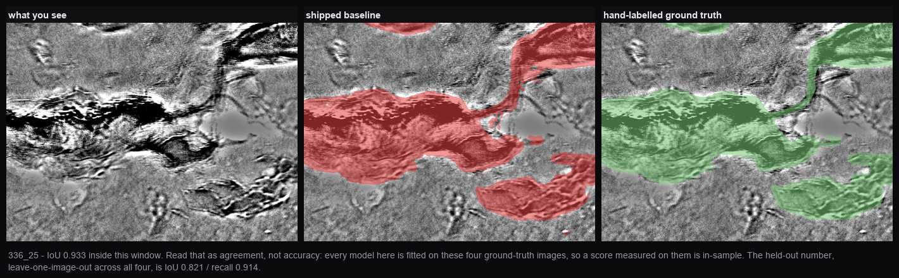

# TXM Crack Detection

Finds cracks in transmission X-ray microscopy images. Drag images in, look at what the
model found, fix what it got wrong, press Retrain. That is the whole loop.

## Run it

```bash
git clone https://github.com/jzhang29-max/TXM_Crack_Detection_Pipeline.git && cd TXM_Crack_Detection_Pipeline && ./run_app.sh
```

Then open **http://127.0.0.1:8800**. The script makes its own virtualenv, installs
everything and serves the app; re-running it just starts the app.

- **Python 3.10 is the floor, 3.12 is tested.** Check `python3 -V` first — 3.9 fails in
  pip's resolver.
- Apple Silicon, CUDA and CPU-only all work. A GPU makes the SAM step ~10× faster.
- `PORT=9000 ./run_app.sh` if 8800 is taken.
- SAM ViT-H (~2.4 GB) downloads on the first prediction and caches in `~/.cache/huggingface`.
- To check the install rather than trust it: `python3 app/selftest.py`

## 1. Get images in

Drag them onto the window, or click the drop zone. Accepted: `.tif .tiff .png .jpg
.jpeg .bmp`. Budget ~20 s for a 2.9 MP image, a few minutes for a 30 MP mosaic.


Every upload is **destitched** (an FFT notch on the tile-grid frequencies) and
**flat-fielded** automatically, with nothing to configure. Left is what came off the
instrument, the middle panel is what you mark on, the right is the same crack at native
resolution. Both steps preserve geometry, so a mask registers pixel-for-pixel on the
original. Contrast is stretched for display only — the model is fed the raw image.

To load the 71 images that ship with the repo instead of dragging them in:

```bash
.venv/bin/python code/load_all_images.py
.venv/bin/python code/import_research_corrections.py   # attach the not-crack labels
```

Safe to re-run — it skips anything already loaded. A fresh clone has to compute SAM
embeddings first: ~26 min on a GPU, longer CPU-only, resumable, and once only.

## 2. Look at the result


| control | what it does |
|---|---|
| **Show result** | the red predicted-crack overlay on/off |
| **My labels** | the cyan *marked not-crack* overlay on/off |
| status bar, right | `width×height · % crack · N regions` for the sensitivity you are viewing |
| sidebar rows | thumbnail with the result burned in, `% crack`, `edited`, and `older model` if its prediction came from a different model |
| **×** on a row | removes that image and its corrections. Your original file is untouched |

`?image=<part of a filename>` in the URL opens straight to that image, and `&labels=0`
starts with the cyan layer hidden — useful for pointing a colleague at one frame.

## 3. Correct it

Three tools, keys **1**, **2**, **3**:

| tool | gesture | what it does |
|---|---|---|
| **Add crack** | drag | marks crack the model missed |
| **Erase** | drag | marks only the pixels your brush passes over as not-crack |
| **Flip region** | one click | marks a whole connected region as not-crack; click again to flip it back |

**Flip region** resolves your click in three steps: a red blob → that blob; somewhere the
model only half fires (probability > 0.15) → that region; plain background → a flood fill
from the click.

**Every stroke saves itself** the moment you release the mouse — no save button, nothing
held in the browser. **⌘Z / Ctrl+Z** undoes one stroke at a time, 30 deep, and survives a
restart.

## 4. Advanced (collapsed by default)

| control | notes |
|---|---|
| **Brush** | 2–120 px radius |
| **Zoom** / **Fit** | Fit re-fits on window resize unless you set a zoom by hand |
| **Sensitivity** | probability threshold, default 0.50 (calibrated). Lower marks more |
| **Legacy post-processing** | reproduces the older pipeline's cleanup. Off by default; disables Sensitivity while on |
| **Re-apply model** | re-predicts every image with the current model |
| **Undo**, **Reset image** | Reset clears all corrections on the open image (⌘Z restores them) |

## 5. Switch models

The dropdown lists the shipped baseline plus every model you have retrained, each marked
`ready`, `N/M ready` or `needs a pass`, with its measured background error:

```
retrained 20260818_123934 · ready · 0.14% bg
shipped baseline · ready · 0.19% bg
```

Switching to a model already computed for your images is instant — predictions are cached
per (image, model) and hard-linked. This is also how you roll back: select an earlier model.

## 6. Retrain

Trains on every correction across every image plus the reference ground truth, then
deploys only if it passes the gate: IoU must not drop by more than 0.01, **and** false
positives on the confirmed crack-free specimens must not rise by more than 0.5 points. If
it refuses, the message says which half failed and by how much, and the model file is kept.

Every retrain leaves a scorecard under the model picker, and it persists across reloads:

```
held out     0.815  ±0.05
background   0.26%  +0.03pp
in-sample    0.940  ≈ same
deployed 10:27 · details
```

Hover any row for the before/after and the trend; **details** expands to the per-image
held-out scores and per-specimen background figures.

Two caps decide how much of your work is used: **30,000 crack pixels per image**, and
negatives per image = (total crack pixels) ÷ (images with negatives). So strokes spread
over ten images are worth far more than the same effort on one.

When it does deploy, it re-applies the new model to every image inside the same job.

## 7. Export

| item | what you get |
|---|---|
| **Black & white mask** | crack = black, PNG |
| **Overlay image** | the display image with red crack and cyan not-crack burned in |
| **Measurements (CSV)** | one row per region: area, skeleton length, mean and max width, tortuosity, branch points, orientation, boundary roughness, centroid |
| **Everything, all images (.zip)** | the three above for every image plus `summary.csv` (~590 MB at 71 images) |

Exports honour the sensitivity you are viewing.

## 8. Back up your labels

`app_data/` is gitignored and regenerable — except your correction labels, which live only
on your disk. They compress to almost nothing:

```bash
python3 code/backup_labels.py            # 850 MB of masks -> 4.1 MB in paint/app_labels.npz
python3 code/backup_labels.py --status   # what is saved vs what is live
python3 code/backup_labels.py --restore  # write them back after a loss
```

Run it after a labelling session. Keyed by filename, not image id.

## How it works, end to end


Every panel is a real array from the app's own modules, regenerated by
`python3 research/code/generate_pipeline_diagram.py` — it imports the same code the running
app imports, so the figure cannot drift from what actually ships.

## What the model is

**273 features per pixel** — Meta's Segment Anything ViT-H image embedding (256 channels)
concatenated with 17 hand-crafted ones: intensity, Gaussian-smoothed intensity at σ=2…64,
gradient magnitude, Laplacian, and local-standard-deviation texture.

A mean-probability ensemble of two MLPs on those features — one on the 17 alone, one on all
273. A single HistGradientBoosting scored better on every labelled-pixel metric and was
tried; it marked 7.5× more crack-free material as crack and was reverted. That measurement
is in [docs/REFERENCE_FRAMES_AND_HGB.md](docs/REFERENCE_FRAMES_AND_HGB.md).

The four dense reference frames in `dataset_cache/` are a **held-out test set**: nothing
trains on them, or on corrections from their specimens, so the retrain gate's number is a
real generalisation number.

## How well it does



The model's output beside the hand-labelled truth for the same window.

- **IoU 0.741, recall 0.809** on the four dense reference frames. Those frames are held out
  of training entirely — nothing trains on them, or on corrections from their specimens — so
  this is a generalisation number, not an in-sample one.
- **IoU 0.763** under cross-validation grouped by image (fold sd 0.035, worst fold 0.721),
  a second protocol over a wider set of images.
- **0.250% of area** marked as crack on the six specimens confirmed to contain no crack, and
  **4.0 false indications per frame**. MIL-HDBK-1823A treats ≤1% probability of false calls
  as the NDT yardstick.
- **100% of large flaws detected** — everything over 20 k px, which is 96.2% of all crack area.
- Zero-shot SAM, prompted the way SAM is designed to be prompted, scores **0.23–0.36** on
  the same images.

The shipped model reports 0.741 where its predecessor reported 0.940. The predecessor trained
on the frames it was scored on; this one does not. Measured directly, that difference is
+0.207 IoU of inflation, so the lower number is the one that describes an unseen image.

Full per-specimen breakdowns, the validation protocol and a 78-variant architecture sweep
are in `docs/` — `REFERENCE_FRAMES_AND_HGB.md`, `SAM_COMBINATION_SWEEP.md`,
`SAM_COMPARISON.md`, `PUBLISHABILITY.md` and `HANDOFF.md`.

**Why SAM 1 and not SAM 2 or SAM 3?** Measured, not assumed:
[docs/ENCODER_COMPARISON.md](docs/ENCODER_COMPARISON.md). SAM 2's features are more
discriminative in isolation (+0.021 IoU on the hybrid member, p=0.029) but that advantage
vanishes in the shipped ensemble (+0.001, p=0.87) and comes with a nominal false-positive
cost. SAM 3's weights are gated behind Meta's manual approval; the comparison harness has its
arm wired in and runs unchanged once access is granted.

## Security

**No authentication.** It binds `127.0.0.1` with `debug=False` and should stay there — do
not put it behind a lab reverse proxy or a tunnel as it is. Anyone who can reach the port
can read or delete every image and start a retrain. Model files are unpickled with
`joblib`, which executes arbitrary code by construction, so only load `.joblib` files you
produced or trust.

## Layout

```
app/server.py          the web app
app/core/model.py      the deployed model, one predict() call
app/core/pipeline.py   ingest + retrain, including the validation gate
app/core/store.py      per-image storage and the model registry
app/static/index.html  the whole frontend
code/                  features, destitch, flatfield, SAM harness, batch utilities
images/                all 71 raw TXM images, bit-exact float32 TIFF (predictor 3)
dataset_cache/         the reference ground-truth images (needed to validate a retrain)
models/                the two shipped models: pixel_hgb_final (17-feature member)
                       and hybrid_nogt_20260821 (SAM+17 member), averaged at predict time
app_data/              your uploads, embeddings and retrained models (gitignored)
```

Nothing points outside the checkout, so moving or deleting your originals cannot break the app.

## Licence

- **Code** — MIT, see [LICENSE](LICENSE).
- **Data** — CC BY 4.0, see [LICENSE-DATA](LICENSE-DATA), covering `images/`,
  `dataset_cache/`, `paint/corrections/` and the derived results. Free to reuse with
  credit; please cite the repository.

If you use the labels, read `docs/HANDOFF.md` section 4 first — it records which labels are
hand-drawn and which are geometric.
