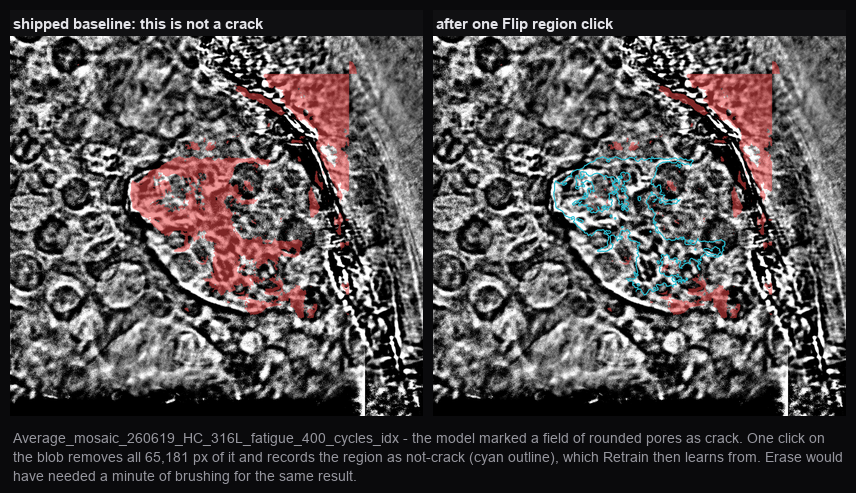

# TXM Crack Detection — Quickstart

Detects cracks in transmission X-ray microscopy images. Drag images in, look at
what the model found, fix what it got wrong, press Retrain. That is the whole loop.

## What it looks like


Sidebar lists your images with the result burned into each thumbnail; the toolbar is the
three correction tools, the two view toggles, and Retrain. The model picker is bottom
left. Every stroke saves itself -- there is no save button.

### Every upload is destitched and flat-fielded automatically


Drop an image in and two corrections run before you ever see it, with nothing to
configure:

1. **FFT destitch** — the mosaic tile grid is periodic, so it is one to two frequency
   bins in the row/column profile. `code/destitch.py` notches exactly those bins, with a
   protection pass that blends the correction back wherever real structure would be
   damaged.
2. **Flat-field** — divide by an anisotropic Gaussian blur (σ_y=16, σ_x=22, both
   measured for this dataset's tile pitch) to remove the macro brightness gradient.

Left is what came off the instrument: a 5×3 tile grid, a bright blob, and a crack you can
barely see. Right is what you mark on. Both steps preserve geometry, so a mask still
registers pixel-for-pixel on the original.

**The model is still fed the raw image**, deliberately: flat-fielding as *model input* was
tried and cost 0.169 IoU, because large-radius intensity features are ~41% of the model's
importance and flat-fielding removes exactly those. So what the human sees and what the
model sees are different on purpose. If preprocessing ever fails, the app falls back to
raw and says so in red rather than letting you mark an unprocessed frame believing
otherwise.

### A crack it finds well


Left, the image as you see it (destitched and flat-fielded). Right, the model's output.
It traces the fine branching hairline accurately, down to individual branches a few
pixels wide -- and this is an AM/HC specimen, a group with **no** pixel-level ground
truth, so nothing about this frame was used to fit or validate the model.

Look at the top and right edges: the dark off-specimen background is also marked red.
That is a false positive, and it is the honest reason the correction tools exist.

### Correcting it



Red is predicted crack, cyan is what a human marked as *not* crack. **Flip region** takes
a whole connected blob in one click, so a false positive the size of the frame is one
click rather than a minute of brushing. Press Retrain and those labels become training
data.

### How well does it do, honestly

On the four ground-truth images (all one specimen group, B2) under leave-one-image-out:
mean IoU **0.821**, recall **0.914**, and on six specimens the owner confirmed
crack-free the **shipped baseline** marks **0.21%** of area as crack (measured).

> **Check which model you are on.** Those numbers are the shipped baseline's. A model
> retrained in the app can be far worse at background and still deploy, because until
> recently the gate only compared IoU on the four B2 ground-truth images. A retrain on a
> single image's corrections measured **22.4%** of crack-free specimen area marked as
> crack -- 107x the baseline -- and passed. The gate now also refuses any candidate whose
> false-positive rate on the crack-free specimens rises by more than 0.5 points, but
> models deployed before that fix are still in your history. The model picker's
> `shipped baseline` entry is the measured-good one. Zero-shot SAM, prompted the way SAM is
designed to be prompted, scores 0.23-0.36 on the same images.

Performance varies a lot by specimen group, and the examples above were chosen to show
both ends. Some frames over-predict substantially -- wide red bands around a crack rather
than the crack itself. There is no ground truth outside B2, so outside B2 those numbers
are unverified and your eye is the only judge. `docs/SAM_COMPARISON.md` has the full study
and `docs/HANDOFF.md` records four approaches that were tried and reverted.

## Run it

One command. Nothing to install first, nothing to configure:

```bash
git clone https://github.com/jzhang29-max/TXM_Crack_Detection_Pipeline.git && cd TXM_Crack_Detection_Pipeline && ./run_app.sh
```

Then open **http://127.0.0.1:8800**.

That script creates its own virtualenv, installs dependencies, expands the bundled
reference data, and serves the app. Re-running it later just starts the app -- it
notices the venv already exists and that requirements have not changed.

Python 3.9+ is the only prerequisite. Apple Silicon, CUDA and CPU-only all work; a
GPU makes the SAM step ~10x faster but nothing requires one. `PORT=9000 ./run_app.sh`
if 8800 is taken.

Two things happen once, not on every start:

- **SAM ViT-H (~2.4 GB)** downloads from HuggingFace on the first prediction and
  caches in `~/.cache/huggingface`.
- **Reference feature stacks (2.1 GB)** are computed on the first *Retrain*, not at
  startup -- nothing else reads them, and building them eagerly used to add several
  silent minutes before the app would serve.

To check your install rather than trust it:

```bash
python3 app/selftest.py
```

## What is in here

This one repo is both the tool and the record of how it was built. A new user only
needs the first four entries:

| | |
|---|---|
| `run_app.sh` | the only command you need |
| `app/` | the server and the single-file frontend |
| `code/` | the feature extraction, preprocessing and measurement modules the app imports, plus the batch utilities (`load_all_images.py`, `import_research_corrections.py`) |
| `images/` | **all 71 raw TXM images**, bit-exact. Deflate-compressed float32 TIFF with the floating-point predictor: 2.26 GB instead of 3.40 GB, every file under GitHub's 100 MB limit (two of the originals were 122 MB and could not be pushed at all). Verified 71/71 identical to the originals. Read them with `tifffile` or GDAL; if a tool cannot handle predictor 3, re-save with `tifffile.imwrite(out, tifffile.imread(src))` |
| `models/`, `dataset_cache/`, `paint/corrections/` | the shipped models, the 4 reference ground-truth images, and the correction labels |
| `docs/` | how the model was arrived at. `HANDOFF.md` is the development record including four approaches that were adopted and then reverted; `SAM_COMPARISON.md` is the zero-shot SAM study |
| `research/` | result sets, figures and one-off experiment scaffolding. Nothing here is needed to run the app |
| `app_data/` | your uploads, predictions and corrections. Gitignored -- it is yours, and it is not backed up by this repo |

It used to be two repos: this archive plus a slimmed-down `txm-crack-detector` that
`make_package.sh` generated from it. That split cost a double push on every change and
silently drifted once -- a utility was committed here and left out of the generated copy
because it was missing from an explicit file list. One repo, one push, no list.

## Load the 71 shipped images

The app starts empty -- drag images in, or load everything that ships with the repo:

```bash
python3 code/load_all_images.py          # ~45 min for all 71, reusing the cached SAM embeddings
python3 code/import_research_corrections.py   # attach the 264 M not-crack labels
```

The loader skips anything already present by filename, so it is safe to re-run. Both are
optional: the app works on images you drop in yourself.

## Using it

1. **Drag TXM images in** (`.tif`, `.tiff`, `.png`). Each one is automatically
   destitched, flat-fielded, embedded with SAM, and predicted. Budget ~20 s per
   2.9 MP image on a GPU; the progress bar names the stage.
2. **Look.** Red overlay is predicted crack. The image you see is the
   destitched + flat-fielded version, because real cracks are thin and faint and
   are often invisible in raw; the *model* is fed raw, which is what it was
   trained on. Both corrections preserve geometry, so the mask registers exactly.
3. **Correct.** Three tools, and the difference between the last two is the
   gesture:

   | tool | gesture | what it does |
   |---|---|---|
   | **Add crack** | drag | paints crack the model missed |
   | **Erase** | drag | removes *only the pixels your brush passes over* |
   | **Delete region** | one click | removes *an entire connected blob* of the result |

   Use Erase for trimming an edge or thinning a stroke. Use Delete region for a
   false positive too big to brush out -- one click takes the whole thing. The
   status bar restates this whenever you switch tools.

   Every stroke saves itself the moment you release the mouse. There is no save
   button and nothing is held in the browser: the correction is on disk before the
   request returns, verified by killing the server mid-session and restarting.
   `Cmd+Z` / `Ctrl+Z` undoes one stroke at a time, 30 deep, and survives a restart.
4. **Retrain.** Trains on every correction you have painted across every image,
   validates against the reference ground truth, and deploys only if it does not
   regress. When it deploys it **re-applies the new model to all your images inside
   the same job**, so you do not have to press anything else and nothing is lost if
   you close the tab while it runs.
5. **Switch models** with the dropdown in the bottom-left. It lists the shipped
   baseline plus every model you have retrained, and says which are `ready`.
   Switching to a model already computed for your images is instant -- predictions
   are cached per (image, model) and hard-linked, so N models cost N predictions on
   disk rather than 2N. A model that has not seen an image yet gets a prediction
   pass, and the image you are looking at goes first in the queue.
6. **Export** gives the B&W mask, the overlay, per-crack measurements as CSV, or
   everything for every image as a zip. Exports honour the sensitivity you are
   viewing, so what you see is what you get.

Nothing here needs a config file edited or a script run in the right order.

## What the model is

A mean-probability ensemble of two models:

- **17 hand-crafted features → MLP.** Intensity, Gaussian-smoothed intensity at
  σ=2…64, gradient magnitude, Laplacian, and local-standard-deviation texture.
- **SAM + those 17 → MLP.** Meta's Segment Anything ViT-H image embedding (256
  channels) concatenated with the same 17 features.

Measured under leave-one-image-out on the 4 Ilastik ground-truth images, with
false positives measured on 6 specimens confirmed crack-free by the specimen owner:

| approach | mean IoU | pixel-weighted IoU | recall | crack-free FP |
|---|---|---|---|---|
| 17 features alone | 0.744 | 0.721 | 0.891 | 7.43% |
| SAM + 17 (hybrid alone) | 0.795 | 0.719 | 0.894 | 0.14% |
| **ensemble of the two (default)** | **0.821** | **0.777** | **0.914** | **0.11%** |

The hybrid alone only *ties* the simple model once you weight by pixel count,
because it loses badly on the largest image — which is 73% of all labelled
pixels. Averaging wins on every image, on both weightings, with recall going up
rather than being traded away. That is why the default is the ensemble.

Zero-shot SAM, used the way SAM is designed to be used (prompt it, read out
masks), scores 0.23–0.36 here and is not usable. See `SAM_COMPARISON.md` for the
full study, including 33 verified citations.

## Things worth knowing before you trust a number

- **Ground truth is 4 images, all one specimen group, all wide-open cracks**
  (median crack width 65 px). With n=4 an exact sign test cannot go below
  p=0.125, so nothing here can be statistically significant. Treat differences
  under ~0.015 IoU as indistinguishable from reseeding — that is the measured
  run-to-run noise.
- **Post-processing is off by default and is under suspicion.** The
  shape-validation and minimum-size filter measurably removes thin crack: on one
  ground-truth image it costs 0.084 IoU and 0.072 recall, and hand-painted stroke
  recall drops from ~0.87 at a raw threshold to 0.14–0.40 after it. Toggle it on
  if you want the old behaviour.
- **Retrain refuses to deploy a regression.** A candidate must hold IoU within
  0.01. Every regression this project has had passed a single-metric check —
  an over-aggressive filter and a good one both reduce predicted area, and only
  recall against ground truth separates them.
- If you retrain and it says *not deployed*, the model file is still saved so you
  can inspect it. **Roll back** restores the previous model.

## Layout

```
app/server.py          the web app
app/core/model.py      the deployed model, one predict() call
app/core/pipeline.py   ingest + retrain, including the validation gate
app/core/store.py      per-image storage and the model registry
app/static/index.html  the whole frontend
code/                  the research pipeline: features, destitch, flatfield, SAM harness
dataset_cache/         the 4 ground-truth images (needed to validate a retrain)
models/                shipped model weights
app_data/              your uploads, embeddings and retrained models (gitignored)
```

Your data lives in `app_data/` inside the checkout. Nothing points at an absolute
path outside it, so moving or deleting your original files cannot break the app.
