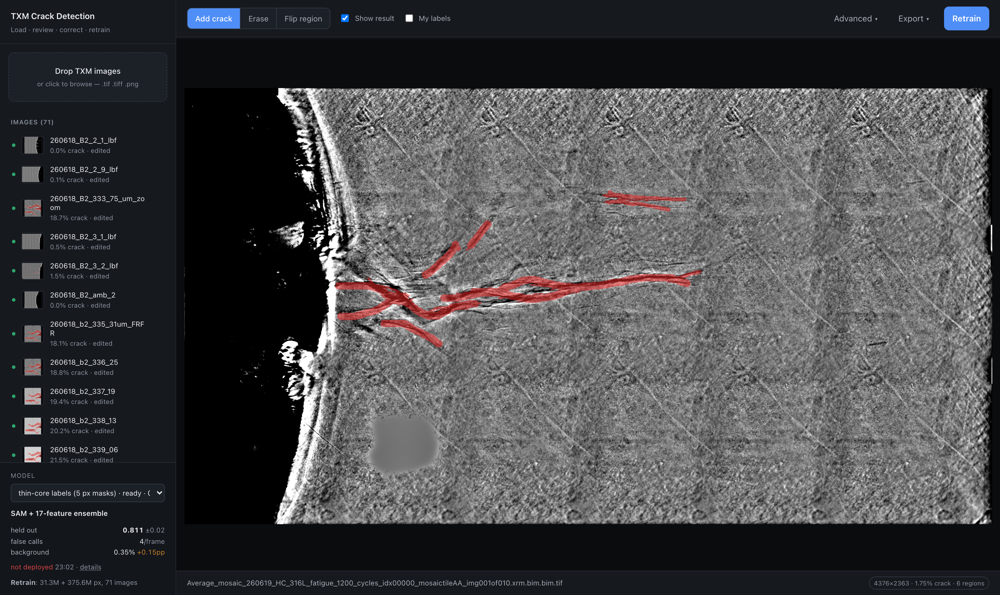
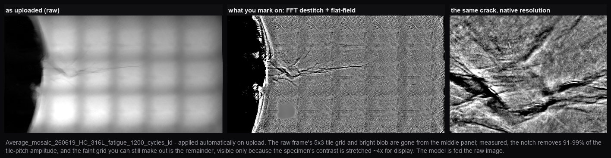
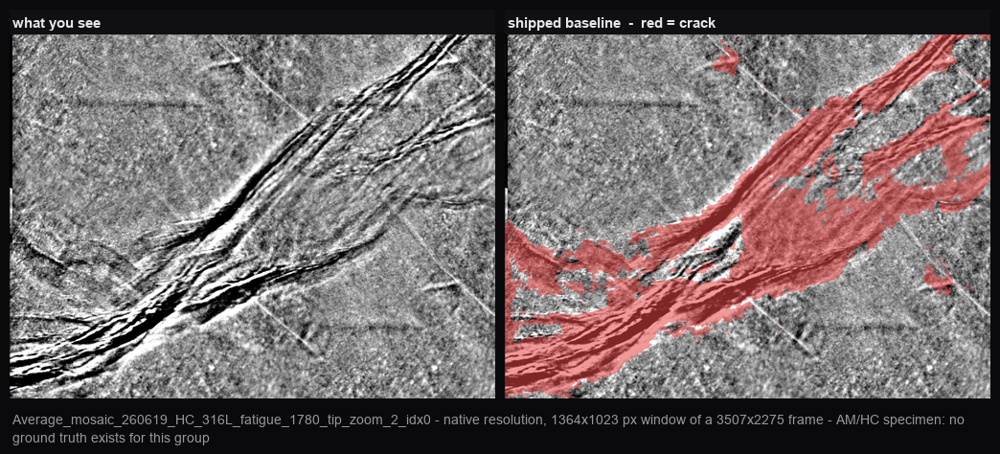
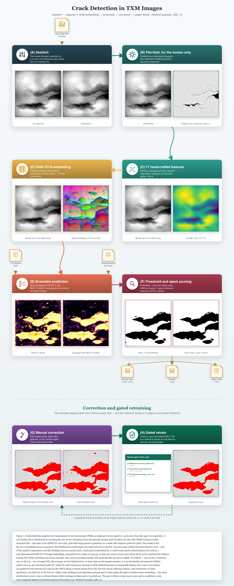

# TXM Crack Detection

[](https://github.com/jzhang29-max/TXM_Crack_Detection_Pipeline/actions/workflows/linux.yml)

Finds cracks in transmission X-ray microscopy images. Drag images in, look at what the
model found, fix what it got wrong, press Retrain. That is the whole loop.



Red is what the model found. The sidebar carries every loaded frame, the current model, and
the last retrain's scorecard. Regenerate this figure with
`python3 code/make_frontend_figure.py` while the app is running.

## Run it

```bash
git clone https://github.com/jzhang29-max/TXM_Crack_Detection_Pipeline.git && cd TXM_Crack_Detection_Pipeline && ./run_app.sh
```

Then open **http://127.0.0.1:8800**. The script makes its own virtualenv, installs
everything and serves the app; re-running it just starts the app.

**The clone is ~4.5 GB** because all 71 real TXM frames ship with it, so the app has
something to show on first run. `--depth 1` only brings that to ~4.3 GB — measured, not
guessed: the frames are 2.1 GB of the *current* tree, so skipping history barely helps.
Budget the full download.

- **Python 3.10 is the floor, 3.12 is tested.** Check `python3 -V` first — 3.9 fails in
  pip's resolver.
- Apple Silicon, CUDA and CPU-only all work. A GPU makes the SAM step ~10× faster.
- `PORT=9000 ./run_app.sh` if 8800 is taken.
- SAM ViT-H (~2.4 GB) downloads on the first prediction and caches in `~/.cache/huggingface`.
- To check the install rather than trust it: `python3 app/selftest.py`

## 1. Get images in

Drag them onto the window, or click the drop zone. Accepted: `.tif .tiff .png .jpg
.jpeg .bmp`. Budget ~20 s for a 2.9 MP image, a few minutes for a 30 MP mosaic.



Every upload is **destitched** (an FFT notch on the tile-grid frequencies) and
**flat-fielded** automatically, with nothing to configure. Left is what came off the
instrument, the middle panel is what you mark on, the right is the same crack at native
resolution. Both steps preserve geometry, so a mask registers pixel-for-pixel on the
original. Contrast is stretched for display only — the model is fed the raw image.

To load the 71 images that ship with the repo instead of dragging them in:

```bash
.venv/bin/python code/load_all_images.py
.venv/bin/python code/import_research_corrections.py   # attach the not-crack labels
```

Safe to re-run — it skips anything already loaded. A fresh clone has to compute SAM
embeddings first: ~26 min on a GPU, longer CPU-only, resumable, and once only.

## 2. Look at the result



| control | what it does |
|---|---|
| **Show result** | the red predicted-crack overlay on/off |
| **My labels** | the cyan *marked not-crack* overlay on/off |
| status bar, right | `width×height · % crack · N regions` for the sensitivity you are viewing |
| sidebar rows | thumbnail with the result burned in, `% crack`, `edited`, and `older model` if its prediction came from a different model |
| **×** on a row | removes that image and its corrections. Your original file is untouched |

`?image=<part of a filename>` in the URL opens straight to that image, and `&labels=0`
starts with the cyan layer hidden — useful for pointing a colleague at one frame.

## 3. Correct it

Three tools, keys **1**, **2**, **3**:

| tool | gesture | what it does |
|---|---|---|
| **Add crack** | drag | marks crack the model missed |
| **Erase** | drag | marks only the pixels your brush passes over as not-crack |
| **Flip region** | one click | marks a whole connected region as not-crack; click again to flip it back |

**Flip region** resolves your click in three steps: a red blob → that blob; somewhere the
model only half fires (probability > 0.15) → that region; plain background → a flood fill
from the click.

**Every stroke saves itself** the moment you release the mouse — no save button, nothing
held in the browser. **⌘Z / Ctrl+Z** undoes one stroke at a time, 30 deep, and survives a
restart.

## 4. Advanced (collapsed by default)

| control | notes |
|---|---|
| **Brush** | 2–120 px radius |
| **Zoom** / **Fit** | Fit re-fits on window resize unless you set a zoom by hand |
| **Sensitivity** | probability threshold, default 0.60. Lower marks more — and below ~0.48 the mask floods, see the note in the panel |
| **Legacy post-processing** | reproduces the older pipeline's cleanup. Off by default; disables Sensitivity while on |
| **Re-apply model** | re-predicts every image with the current model |
| **Undo**, **Reset image** | Reset clears all corrections on the open image (⌘Z restores them) |

## 5. Switch models

The dropdown lists the shipped baseline plus every model you have retrained, each marked
`ready`, `N/M ready` or `needs a pass`, with its measured background error:

```
retrained 20260818_123934 · ready · 0.14% bg
shipped baseline · ready · 0.19% bg
```

Switching to a model already computed for your images is instant — predictions are cached
per (image, model) and hard-linked. This is also how you roll back: select an earlier model.

## 6. Retrain

Trains on every correction across every image — and on nothing else, no external labels
anywhere — then deploys only if it passes the gate: IoU must not drop by more than 0.01,
**and** false positives on the confirmed crack-free specimens must not rise by more than
0.5 points. If it refuses, the message says which axis failed and by how much, and the model
file is kept.

Neither axis uses a label you did not draw: the first is cross-validation on your own
corrections, the second is measured on specimens you confirmed contain no crack, where any
prediction is a false positive by construction.

**A refused model is still selectable.** It never becomes current on its own — that is what the
gate is for — but it appears in the model picker marked `REFUSED by the gate`, and choosing it
asks for confirmation and shows the gate's own reason. A rejected model used to be written to
disk, described in the scorecard, and then unreachable, so there was no way to look at the masks
behind the numbers or compare them against the current model on the same frame. Refusing to
deploy something should mean you have to pick it deliberately, not that you cannot see it.

Every retrain leaves a scorecard under the model picker, and it persists across reloads:

```
held out     0.811  ±0.02
false calls  2.0/frame
background   0.17%  −0.03pp
deployed 12:35 · details
```

Hover any row for the before/after and the trend; **details** expands to the per-image
held-out scores and per-specimen background figures.

Two caps decide how much of your work is used: **30,000 crack pixels per image**, and
negatives per image = (total crack pixels) ÷ (images with negatives). So strokes spread
over ten images are worth far more than the same effort on one.

When it does deploy, it re-applies the new model to every image inside the same job.

### Diagnostics, if you ever need them

Three switches used to sit in **Advanced** and were removed: leaving one on silently changes
every picture and number afterwards, and one of them stopped the canvas showing your
corrections at all. They are still reachable as URL parameters, appended to any
`mask.png`, `overlay.png` or `stats` request:

| parameter | effect |
|---|---|
| `tight=0` | the wider, label-shaped boundary — the mask before the image narrows it |
| `corrections=none` | the model's raw prediction, ignoring your corrections. How you check whether a retrain actually learned a region or is having your answer pasted back |
| `postprocess=1` | the legacy hysteresis cleanup. Measured to delete thin crack (−0.08 IoU); it exists to reproduce old outputs, not to improve new ones |

## 7. Export

| item | what you get |
|---|---|
| **Black & white mask** | crack = black, PNG |
| **Overlay image** | the display image with red crack and cyan not-crack burned in |
| **Measurements (CSV)** | one row per region: area, skeleton length, mean and max width, tortuosity, branch points, orientation, boundary roughness, centroid |
| **Everything, all images (.zip)** | the three above for every image plus `summary.csv` (~590 MB at 71 images) |

Exports honour the sensitivity you are viewing.

## 8. Back up your labels

`app_data/` is gitignored and regenerable — except your correction labels, which live only
on your disk. They compress to almost nothing:

```bash
python3 code/backup_labels.py            # 850 MB of masks -> 4.1 MB in paint/app_labels.npz
python3 code/backup_labels.py --status   # what is saved vs what is live
python3 code/backup_labels.py --restore  # write them back after a loss
```

Run it after a labelling session. Keyed by filename, not image id.

## How it works, end to end



Every panel is a real array from the app's own modules, regenerated by
`python3 research/code/generate_pipeline_diagram.py` — it imports the same code the running
app imports, so the figure cannot drift from what actually ships.

In words, for one image:

1. **Clean it up for your eyes only.** The mosaic tile grid is a periodic pattern, so it is
   notched out in the frequency domain; then the frame is flat-fielded and contrast-stretched.
   This is the picture you paint on. The model is deliberately fed the *raw* frame instead —
   flat-fielding the model input was tried and cost 0.169 IoU, because absolute brightness over
   large distances is most of what tells the model a crack from ordinary texture.
2. **Describe every pixel twice.** Once with 17 hand-written measurements (how bright, how
   bright the neighbourhood is at six scales, how fast brightness changes, how rough the local
   texture is). Once with a 256-number summary from Meta's Segment Anything image encoder, run
   over overlapping 1024 px tiles and blended across the overlap. That is 273 numbers per pixel.
3. **Ask two small neural networks, and average them.** One sees only the 17 measurements, one
   sees all 273. Their average is the crack probability. Averaging beats either alone.
4. **Turn probability into a mask.** Keep pixels above 0.60, drop isolated blobs under 2000 px,
   fill pinholes, then narrow what is left to the darker core inside it using the image itself.
   That last step is why the mask is a few pixels across rather than tens. Narrowing opens new
   pinholes of its own — 342,963 of them across the corpus, which is what read as unfilled
   centres in a black-and-white export — so the fill runs again afterwards, leaving 894.
5. **You correct it.** Paint missed crack, erase false positives, or click once to remove a whole
   wrong region. Your strokes are saved immediately and always win over the model on screen.
6. **Retrain learns from your corrections and nothing else.** No external labels are used
   anywhere. Each crack stroke is narrowed to the crack inside it before training, so the model
   learns crack width rather than brush width.
7. **A gate decides whether the new model ships.** It has to hold cross-validated accuracy
   (folds hold out whole images) *and* not mark more of the specimens you confirmed are
   crack-free. If it fails, it is not deployed — but it stays in the model picker, marked, so you
   can look at what it predicts and switch back at any time.

## What the model is

**273 features per pixel** — Meta's Segment Anything ViT-H image embedding (256 channels)
concatenated with 17 hand-crafted ones: intensity, Gaussian-smoothed intensity at σ=2…64,
gradient magnitude, Laplacian, and local-standard-deviation texture.

The embedding is computed on 1024 px tiles stepped by 896 so neighbours overlap, then blended
across the overlap. With tiles abutting, the embedding stepped at every tile boundary and the
step reached the output as a visible seam — measured at 33× the frame's typical row-to-row
change. Details in [docs/TILE_SEAMS.md](docs/TILE_SEAMS.md).

A mean-probability ensemble of two MLPs on those features — one on the 17 alone, one on all
273. Averaging beats either member alone: 0.811 against 0.786 for the SAM hybrid alone and 0.726
for the 17 features alone.

**It is trained on your strokes narrowed to the crack inside them.** A brush stroke is far wider
than the crack it marks — median half-width 26.9 px against a 3.2 px dark core — and a model
trained on the strokes reproduces the brush, not the crack. Before sampling, each crack label is
narrowed to its dark core and the discarded ring is treated as background, which is what makes
the output about 5 px across instead of 22. [docs/THIN_LABELS.md](docs/THIN_LABELS.md).
A single HistGradientBoosting scored better on every labelled-pixel metric and was tried; it
marked 7.5× more crack-free material as crack and was reverted. That measurement is in
[docs/REFERENCE_FRAMES_AND_HGB.md](docs/REFERENCE_FRAMES_AND_HGB.md). Adjusting the contrast
of the model input was tested too, across 19 arms — it does not help, and most of it hurts:
[docs/CONTRAST.md](docs/CONTRAST.md).

Nothing is held back from training, and nothing is scored against a label you did not draw.
The retrain gate has two axes: cross-validation grouped by whole image, so train and test
never share a frame, and predicted area on the specimens you confirmed contain no crack,
where any prediction is a false positive by construction.

## How well it does

- **IoU 0.811** under cross-validation grouped by image — train and test never share an
  image (fold sd 0.023, worst fold 0.778, precision 0.936, recall 0.860). This is the
  headline number because it is the only one that answers "how will this do on an image it
  has not seen".
- **0.174% of area** marked as crack on the six specimens confirmed to contain no crack —
  0.046% once specks under 2000 px are pruned, which is what an export actually contains — and
  **2.0 false indications per frame**. MIL-HDBK-1823A treats ≤1% probability of false calls as
  the NDT yardstick. Against the previous model this axis is roughly a wash: 0.209% → 0.174%
  unpruned, 0.035% → 0.046% pruned, 1.83 → 2.0 indications. The gain is in width and IoU, not
  here.
- **Masks about 5 px across rather than 22.** The model is trained on crack labels narrowed to
  their dark core, so it predicts something close to the crack rather than the width of the
  brush that marked it — see [docs/THIN_LABELS.md](docs/THIN_LABELS.md).
- **What that IoU does and does not answer.** Folds hold out whole *images*, and the 71 frames
  come from four specimens, so a held-out frame still has siblings in training. That makes it
  the right number for the normal use of this tool — tracking a crack across a load series on a
  specimen you have labelled. It is **not** the number for an unlabelled specimen: holding out a
  whole specimen group instead drops the same measurement to **0.51–0.67**. Both are honest;
  they answer different questions. [docs/RIDGE_FILTERS.md](docs/RIDGE_FILTERS.md) has the
  side-by-side.
- Zero-shot SAM, prompted the way SAM is designed to be prompted, scores **0.23–0.36** on
  the same images.

**No external labels are used anywhere** — not in training, not in the gate. Both members of
the ensemble are fitted on the owner's own corrections across all 71 images. Earlier models
inherited their 17-feature member from a research artifact trained on four pre-existing masks
made with another tool, so half of every prediction came from labels the owner had not drawn.
That is gone.

Full per-specimen breakdowns, the validation protocol and a 78-variant architecture sweep
are in `docs/` — `REFERENCE_FRAMES_AND_HGB.md`, `SAM_COMBINATION_SWEEP.md`,
`SAM_COMPARISON.md`, `CONTRAST.md`, `THIN_LABELS.md`, `RIDGE_FILTERS.md`, `TILE_SEAMS.md`,
`OVERMARKING.md`,
`PUBLISHABILITY.md`
and `HANDOFF.md`.

**Why is the predicted crack wider than the real one?** Measured, and four fixes tried and
rejected: [docs/OVERMARKING.md](docs/OVERMARKING.md). The model draws a ~15 px hairline about
50 px wide, your own brush strokes are the tighter boundary, and raising the threshold,
dropping the large smoothing scales, image-guided refinement and halving the SAM embedding
stride all trade accuracy for thinness without localising better. The blocker is that every
accuracy number is scored against brush strokes that over-mark too.

**Why SAM 1 and not SAM 2 or SAM 3?** Measured, not assumed:
[docs/ENCODER_COMPARISON.md](docs/ENCODER_COMPARISON.md). SAM 2's features are more
discriminative in isolation (+0.021 IoU on the hybrid member, p=0.029) but that advantage
vanishes in the shipped ensemble (+0.001, p=0.87) and comes with a nominal false-positive
cost. SAM 3's weights are gated behind Meta's manual approval; the comparison harness has its
arm wired in and runs unchanged once access is granted.

## What is in `research/`

Measurement history, not a second way to use the tool: the scripts there predate the app, many
read caches that are not shipped, and several would train from external labels this project no
longer uses anywhere. The supported path is `./run_app.sh` and the Retrain button. The `docs/`
notes cite those scripts as the provenance of published numbers, which is why they are kept.

## Security

**No authentication.** It binds `127.0.0.1` with `debug=False` and should stay there — do
not put it behind a lab reverse proxy or a tunnel as it is. Anyone who can reach the port
can read or delete every image and start a retrain. Model files are unpickled with
`joblib`, which executes arbitrary code by construction, so only load `.joblib` files you
produced or trust.

## Continuous integration

This project was written, measured and documented on one arm64 Mac, so every claim about
Linux was an inference until [`.github/workflows/linux.yml`](.github/workflows/linux.yml)
started executing them. Five jobs, on every push and pull request:

| job | what it proves |
|---|---|
| `suite` | the documented install works on ubuntu-24.04 / python 3.12, and the self test passes there against a real socket on a case-sensitive filesystem |
| `no-torch` | the fallback this README promises is real — without PyTorch an image still ingests and predicts, and the model line says SAM was unavailable instead of pretending otherwise |
| `floor-deps` | the pre-0.26 scikit-image branch of the `remove_small_holes` shim, which the development machine never takes |
| `sam-on-linux` | torch, transformers and the SAM ViT-H encoder load and produce finite embeddings on Linux CPU |
| `run-app` | `./run_app.sh` — the one command this README tells you to type — works from a bare checkout on Debian 12 with the distro python |

Writing it immediately found a real defect: `imagecodecs` was missing from
`requirements.txt`. All 71 shipped images are float32 TIFF with the floating-point predictor,
tifffile refuses those without that package, and nothing pulls it in transitively — so a
clone that installed exactly what was listed could not read a single one of its own images.
Every development machine had it installed by hand, which is why it went unnoticed. The
`suite` job now asserts a real frame decodes, so it cannot go missing again.

Investigating what the no-SAM mode actually produces turned up a second defect, unrelated
to CI. A prediction is cached under a key naming the model that made it, but that key was
taken from the registry's current entry *before* ingest substituted the 17-feature model for
a missing SAM — so the 17-only output was filed under the ensemble's key. Measured end to
end: a run with SAM disabled wrote a 54.80%-crack mask, a later run with SAM fully available
reported "using cached prediction", kept 54.80%, and relabelled it `mean-probability
ensemble`. The bad mask was permanent and credited to the model that never ran. It hit
exactly the person the fallback exists for — whoever starts this behind a firewall. The
fallback now has its own cache key: the same sequence re-predicts and drops to 18.80%.

**What a green tick does not mean.** Four of the five jobs run without SAM, and in that mode
the detector is the 17-feature model alone — not the shipped configuration, and not a usable
one. Over all six confirmed crack-free specimens it marks 26.9% to 83.7% of the frame as
crack (mean 61.3%), where the shipped ensemble marks 0.000% to 0.144%. CI tests plumbing,
portability and invariants, never detection quality. The statistical numbers
in [How well it does](#how-well-it-does) come from the full 71-frame corpus on the
development machine, which no runner has: `app_data/` is gitignored, so CI checks out one
frame and the corpus-wide checks report "1 frame" or skip. Retrain never runs. Neither does
the browser. The workflow's own header spells all of this out at the top of the file.

## Layout

```
app/server.py          the web app
app/core/model.py      the deployed model, one predict() call
app/core/pipeline.py   ingest + retrain, including the validation gate
app/core/store.py      per-image storage and the model registry
app/static/index.html  the whole frontend
code/                  features, destitch, flatfield, SAM harness, batch utilities
images/                all 71 raw TXM images, bit-exact float32 TIFF (predictor 3)
models/                the two shipped models: f17_v5 (17-feature member) and hybrid_v5
                       (SAM+17 member), averaged at predict time. Both trained only on
                       the corrections in this repo
app_data/              your uploads, embeddings and retrained models (gitignored)
```

Nothing points outside the checkout, so moving or deleting your originals cannot break the app.

## Licence

- **Code** — MIT, see [LICENSE](LICENSE).
- **Data** — CC BY 4.0, see [LICENSE-DATA](LICENSE-DATA), covering `images/`,
  `paint/corrections/` and the derived results. Free to reuse with
  credit; please cite the repository.

If you use the labels, read `docs/HANDOFF.md` section 4 first — it records which labels are
hand-drawn and which are geometric.
